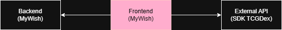

# MyWish frontend

Esse projeto foi gerado usando Angular 20 e [Angular CLI](https://github.com/angular/angular-cli) version 20.3.12.

Ele representa o frontend de uma aplicação voltada para a consulta de cartas de Pokémon, assim como o cadastro
de novas coleções e listas de desejo de usuários.

Nesse momento essa solução representa apenas o MVP, o que significa que há ainda muitas outras alterações a serem feitas
e features a serem adicionadas.

### Diagrama



### API Externa

Conforme a requisição do MVP, esse projeto foi montado pensando em soluções com mais de um serviço conectado,
sendo assim foi utilizada uma API externa, via SDK, para a requisição das cartas em diversas línguas.

A API, TCGDex, pode ser encontrada no seguinte link [https://tcgdex.dev/](https://tcgdex.dev/) e é uma API opensource
e gratuita.

## Execução

Existem várias maneiras para a execução do projeto, mas para fins avaliativos da pós (e para a facilidade de execução)
um Dockerfile foi preparado que contém o build da versão de produção do Angular, bem como todas as configurações necessárias.

### Docker build

Tenha certeza de possuir o npm v10+ para poder rodar primeiro o script de importação do projeto.

```shell script
npm install
```

Agora poderemos buildar a imagem antes da execução do container.

```shell script
docker build -f docker/Dockerfile -t s3-mvp-frontend .
```

E assim que a finalização do build acontecer, rodar com:

```shell script
docker run -p 4200:80 s3-mvp-frontend   
```

Essa imagem já estará rodando como um angular ``prod`` que possui variáveis de ambiente próprias, incluindo uma conexão direta
para a rede docker interna, assim garantindo que poderá se conectar com o backend caso ambas as imagens sejam utilizadas em um mesmo
pod.

A imagem rodará na porta 4200.

### Execução local

Assumindo que você possua o npm instalado na máquina, basta executar

```bash
npm install
ng serve
```
